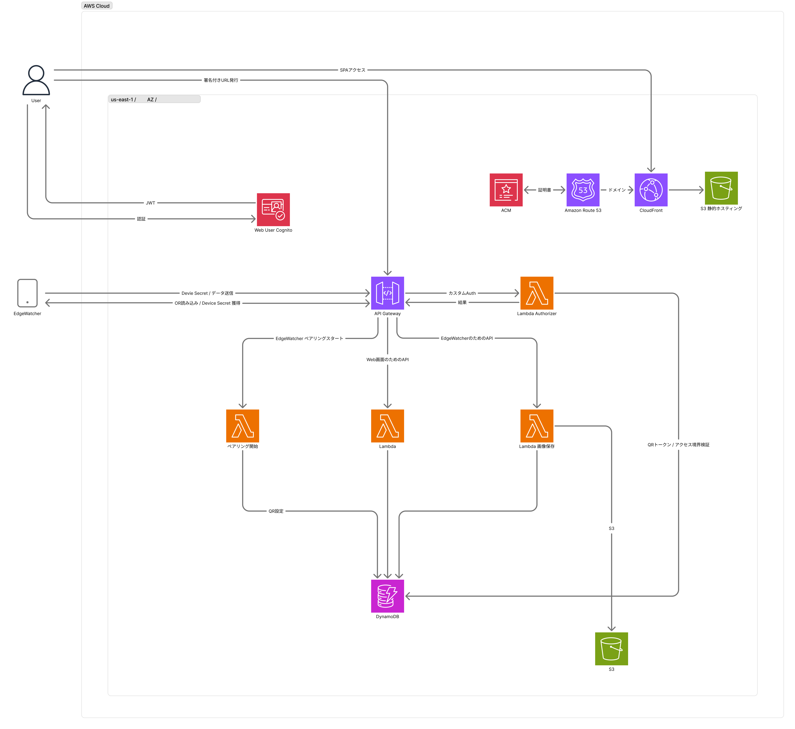

こんにちは！

LinkFarm Tech. の **増井 崇（Shu MASUI）** です。

今回は、日頃より学生団体としてご支援いただいている **一般社団法人NARATIVE（ナラティブ）** 様主催の合宿 **「NARATIVE CAMP」** に参加してきました。

今回の合宿で開発した農地見守りシステム **『EdgeWatcher（エッジウォッチャー）』** のLPとソースコードを公開しています。ぜひあわせてご覧ください。

> **🌾 農地見守りシステム『EdgeWatcher』**
>
> - **公式LP**: [https://edgewatcher-lp.linkfarm-tech.com/](https://edgewatcher-lp.linkfarm-tech.com/)
> - **GitHub**: [https://github.com/ShuMasui/edgewatcher](https://github.com/ShuMasui/edgewatcher)

2026年9月5日〜7日の2泊3日、宇陀市室生を舞台に地域課題と向き合いながら、プロダクトの企画から実装・発表まで駆け抜けた合宿のレポートをお届けします。

---

## NARATIVE CAMPと「青い家」

NARATIVE CAMPは、NARATIVE様が主催する2泊3日の宿泊型アイデア共創合宿です。

会場となったのは、奈良県宇陀市室生地区にある古民家 **「青い家」**（株式会社ウエルアップ様所有）でした。

最寄りの近鉄室生大野駅から徒歩5分ほどで、室生山上公園 芸術の森や室生寺からも近い場所です。9月初旬でしたが現地は涼しく、川のせせらぎを聞きながらとても集中して開発に取り組めました。

---

## サムズアップ農園さんが抱える課題

今回のCAMPのお題は「宇陀が抱える問題なら何でも良い」というものでした。

そこで今回は、LinkFarm Tech.と関わりが深い **サムズアップ農園様** が抱えていた「農地監視システムの高機能・高価問題」にアプローチすることにしました。

### 農地は見に行かなければいけない

この問題の背景には、農業をする人は必ず農地を見に行かなければいけない、という根本的なタスクがあります。

大抵の場合、農地は都市部や自宅から離れた場所にあります。そうなると毎回見に行くのは重労働ですし、雨が降ったときには見に行けないのに「畑は大丈夫か」と気をもむことになります。「見に行かないといけないけれど、行けない / 行くのがしんどい」という大きなジレンマです。

### 既存の監視システムが抱える問題

その解決策として、大手企業が農地監視カメラシステムを提供していることがあります。

しかし、これらは高機能であると同時に非常に高価です。国の補助金を活用して購入できるとしても、月々の運用保守費が高かったり、使わない機能に対価を払い続けたりと、現場のストレスは少なくありません。敷設にも時間がかかります。

見回りの負荷を減らすシステムは必要なのに、既存の解決策は農家の方々に刺さっていないのが現状でした。

---

## 仮説と合宿のゴール

そこで私たちは、次のような仮説を立てました。

> **「高機能・高価格な現状のアプローチより、必要な機能のみに対価を払うモデルの方が、農家様には刺さるのではないか？」**

今回の合宿のゴールは、この仮説を検証するための機材（MVP）を作ることと定めました。

---

## 開発したシステム「EdgeWatcher」

こうして作ったのが、農地見守りシステム **『EdgeWatcher』** です。

仮説を検証するため、以下のコンセプトを設定しました。

- **高価な監視カメラ → スマートフォンで代替**  
  使わなくなったスマホを活用し、機材コストを抑えます。
- **敷設の手間 → QRコード読み取りですぐに利用開始**  
  Webアプリにログイン後、スマホにアプリを入れてQRコードを読み取るだけでペアリング完了。
- **最低限の機能 → 画像単体での表示に絞る**  
  定期撮影された画像をWeb上で確認できるシンプルな機能に特化。

---

## システムアーキテクチャ

EdgeWatcherは、長期的にポートフォリオとして低コストで常時公開しておきたかったため、アイドルコストのかからない **AWS完全サーバーレス構成** を採用しました。

### アーキテクチャのポイント

1. **API Gateway（HTTP API）＋ AWS Lambda**  
   WebアプリとスマートフォンからのAPIリクエストをAPI Gatewayに集約。REST APIではなくHTTP APIを採用して料金を削減し、MVPとしてシンプルな処理をLambdaにまとめました。
2. **SPAの静的配信とCognitoによる制限**  
   Web管理画面はSPA形式でS3とCloudFrontから静的配信し、Cognitoでアクセス制限をかけています。
3. **Lambda Authorizer ＋ DynamoDB による端末認証**  
   スマホアプリ側の認証は、セッションの即時停止への対応や、端末ライフサイクルがWeb側に依存していることから、Lambda Authorizerで完結させました。セッションや端末情報の保存先にはDynamoDBを採用しています。

---

## 開発スケジュール

2泊3日のスケジュールは以下のように進めました。

**2026-09-05（1日目）**

1. コンセプト固め
2. 周辺調査
3. 競合調査
4. ドメインモデルの決定

**2026-09-06（2日目）** 5. インフラリソースの策定6. インフラリソースの作成7. CI/CDパイプラインの作成8. API設計の作成（GraphQL含め）9. コーディング開始

**2026-09-07（3日目）** 10. 単体テスト開始 11. 結合テスト開始 12. E2Eテスト兼動作テスト 13. バグ修正 14. リリース 15. 発表資料作成 16. 成果発表

### コーディング遅延とAIエージェントの活用

実は途中でコーディングが大幅に遅れる問題がありました。そこでAIエージェントを最大限に活用し、複数人の開発者を確保したような体制で並行して実装を進めることで、無事にリリースまでこぎつけることができました。

---

## 成果発表と講評

最終日の発表では、実機スマートフォンとWeb画面を連携させたデモを行いました。

発表後、不動産業界の方から「そのまま実装できそうだね」と講評をいただけたり、実践力の高さを褒めていただけたりと、とても励みになる体験となりました。空き家や遠隔物件の管理などにも通じる手応えを感じることができました。

---

## CAMPそのものが楽しかった

ここまで開発の話ばかり書いてきましたが、NARATIVE CAMPは合宿そのものがとても楽しい3日間でした。

1日目は、作業の合間にみんなで卓球をしたり、夜はカレーを作ったりしました。初対面の方も多かったのですが、手を動かしながら話しているうちに自然と打ち解けられたように思います。

2日目はBBQを楽しみました。そのあと、夜中まで発表の準備をしていたのも含めて良い思い出です。

そして最終日は、それぞれが頑張って発表をしました。みんなが3日間で積み上げてきたものを見られる時間は、素直にうれしかったです。

こうしたイベントごとだけでなく、何気なく朝起きた瞬間にみんなでご飯を作ったり、一緒に食べたりした時間も印象に残っています。開発の成果はもちろん大切ですが、そういう小さなことがすごく楽しかったのだと、あらためて感じています。

---

## さいごに

今回のNARATIVE CAMPは、地域の課題に没頭してモノづくりができる貴重な機会となりました。会場を提供してくださった株式会社ウエルアップ様、そしてNARATIVEの皆様に御礼申し上げます。

EdgeWatcherは今後もポートフォリオとして公開を続けますので、ぜひ触ってみてください。

こういう体験をさせていただいたNARATIVE様には、本当に感謝しています。NARATIVE様とウエルアップ様には3日間本当にお世話になりました！ありがとうございます！

> - 一般社団法人NARATIVE様のHPはこちら: [https://narative.org/](https://narative.org/)
> - 株式会社ウエルアップ様のHPはこちら: [https://wellup-corp.com/](https://wellup-corp.com/)

**LinkFarm Tech. 増井 崇**
