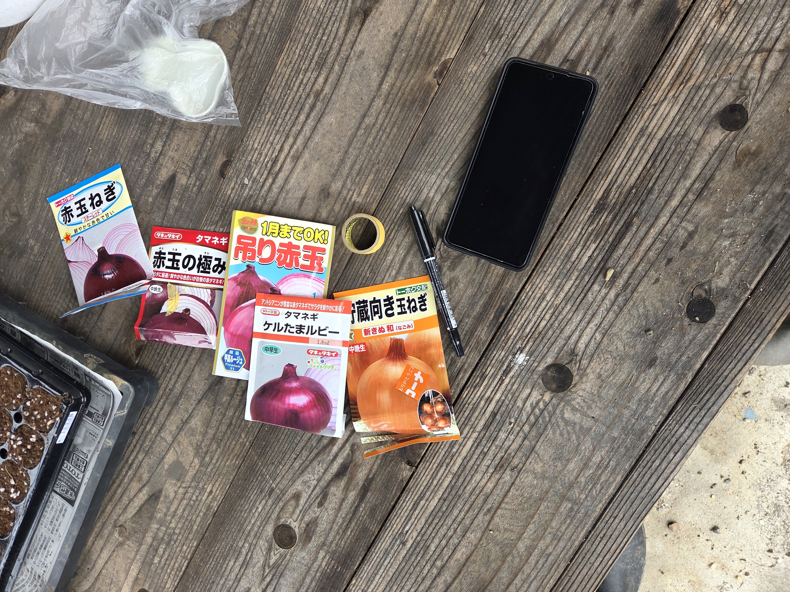

こんにちは！

LinkFarm Tech. の **増井 崇（Shu MASUI）** です。

今回は、奈良県宇陀市室生にある「青い家」（株式会社ウェルアップ様所有）が管理する農地で、農作業ボランティアに参加してきました。

作業を手伝う中で、「農体験は人生単位で豊かになることなんだ」と実感しました。そのときの体験と思索の記録をお届けします。

---

## 参加のきっかけ

今回の農作業のお手伝いは、青い家を運営されている株式会社ウェルアップ様のご厚意によって実現しました。

きっかけは、先日の「NARATIVE CAMP」でのことです。プログラムの中で、ウェルアップ様より料理人兼農業をされている方のトークショーを開いていただく機会がありました。

その中で、「青い家の横にある農地を開墾するにあたって、きれいにしたいから手伝ってくれる人がいたら来てほしい」とおっしゃっていたので、すぐにお願いして参加させていただくことになりました。

当日迎えてくださったウェルアップの松本様、そして作業を教えてくださったマルト醤油の料理人・大田様、ありがとうございました。

---

## 取り組んだ4つの農作業

当日は雨予報に反して雨も降らず、以下の4つの作業に取り組みました。

### 1. 用水路の清掃
長年放置されていた用水路は草木と泥に埋もれて水が溜まり、ボウフラが湧いていました。泥を掻き出し、草木を払って、水が流れるようにしました。

### 2. 刈り草の集積
草刈りで出た大量の草をまとめ、いつでも安全にお焚き上げ（野焼き）ができる状態に整えました。

### 3. 低木や草の根の除去
地面に残った低木の切り株や草の根を取り除き、土を耕せる状態に開墾しました。

### 4. タマネギの種まき
タマネギの種をセルトレイにまいて、苗をつくる準備を行いました。

*▲ 実際にまいたタマネギの種。種にもたくさんの種類があるらしい（トーホク etc...）。*

全部力のいる作業で、虫も多くてなかなか大変でしたが、大田さんのご指導のおかげでスムーズに進めることができました。

---

## 「人生単位で豊かになる」ということ

農体験をして一番言いたいのは、「本当に人生単位で豊かになっているな」と感じられたことです。

この言葉には2つの意味があると思っています。

1. **人生単位の「時間」**
2. **人生単位の「関わり」**

---

## 人生単位の「時間」

時間という意味で、印象深いエピソードが2つあります。

### 用水路と、生まれる前の時間
1つ目は、用水路をきれいにしていたときのことです。

もともと用水路は草木に埋もれて全く見えず、水も溜まって流れていませんでした。しかしきれいに泥を掻き出していくと全貌が見えてきて、次第に水が流れるようになりました。

少し欠けた水路の様子や、再び役割を取り戻した姿を見て、「この水路を作ったのは、きっと自分が生まれる前だったのだろう」と思いました。自分の知り得ない時間のバトンを受け取ったような気がして、深く物思いにふけりました。

### 大田さんの言葉と、農家の時間軸
もう1つは、大田さんの「苗を植えると数週間後に芽が出て、植え付けができて、来年くらいには収穫できるかな。次はこれを一緒に育てよう」という言葉です。

現代人は目の前のタスクに追われがちで、数日や数週間で終わるような短い単位で物事を進めがちです。タスクが細分化された社会では便利ですが、副産物として視野が短くなっていたことに気づかされました。

人生は生きるものですから、生きていく時間の感覚や、命の時間の感覚を大切にしたいと思えるひとときでした。

---

## 人生単位の「関わり」

もう1つの関わりについては、「農業は一人では何もできないな」と痛感したことです。

何事も細分化された世の中なので、「自分にできること＝自分のやるべきことすべて」と考えがちです。しかし農業はできないことが多すぎます。天候もそうだし、先人が開墾した土地や、自分が死んだ後の引き継ぎ、関わる人の思いなど、誰にも変えられないものをそれぞれが持っています。

そんな中で、ぶつかり合いながらも近く遠い関係で結びついているのが農業の深さなのだと感じました。

---

## さいごに

農業を通じて人生単位で豊かになる面白さを体感できた一日でした。この感覚を、LinkFarm Tech.のプロジェクトを通してみなさんにもうまく伝えていければと思います。

受け入れてくださったウェルアップの松本様、大田様、本当にありがとうございました。

---

## 今後のスケジュール

- **9月**：現地での農作業ボランティア・実証実験の推進
- **10月〜**：奈良の農業とスマート技術を学ぶ農業講座・定期イベントの開催
- **翌年2月**：収穫した農産物を使って、みんなで美味しい料理を作って楽しむ収穫祭

**LinkFarm Tech. 増井 崇**
